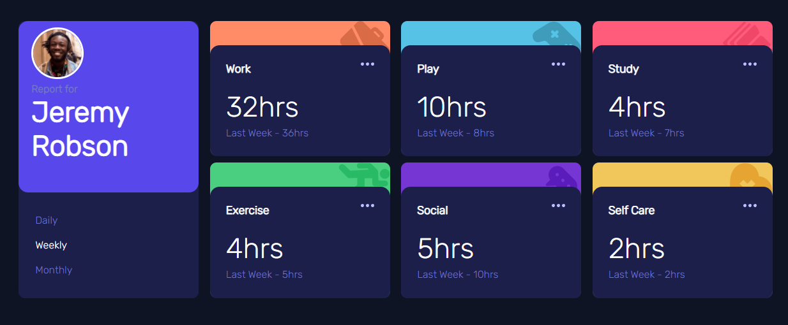

# Time Tracking Dashboard with HTML, CSS, & JavaScript

This is a solution to the [Frontent Mentor](https://www.frontendmentor.io) Time Tracking Dashboard challenge. Frontend Mentor provides frontend designs that helps improve coding skills by building realistic projects.

### The challenge

- Build out the project to the designs provided.

### Final Outcome

### Links

- [Click to play with the Live site](https://jcsmileyjr.github.io/Time-Tracking-Dashboard/)
- [Click to read the blog post showing lots of GIFS, images, and detailing the development journey](https://dev.to/jcsmileyjr/frontend-challenge-12-time-tracking-dashboard-jdc)

### Built with

- Semantic HTML5 markup
- CSS custom properties
- CSS Grid
- Mobile-first workflow
- Javascript functionality like the Fetch API to grab data from a JSON
- 

## Author

- Website - [JC Smiley](https://www.jcsmileyjr.com)
- Frontend Mentor - [@jcsmileyjr](https://www.frontendmentor.io/profile/jcsmileyjr)
- Twitter - [@JCSmiley4](https://twitter.com/JCSmiley4)
